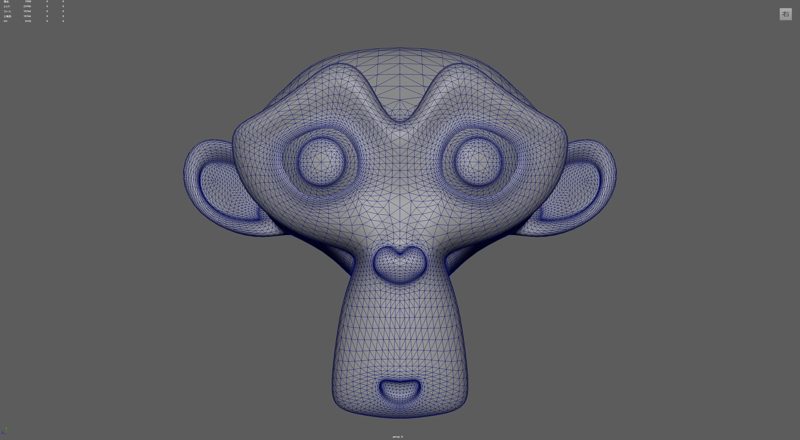
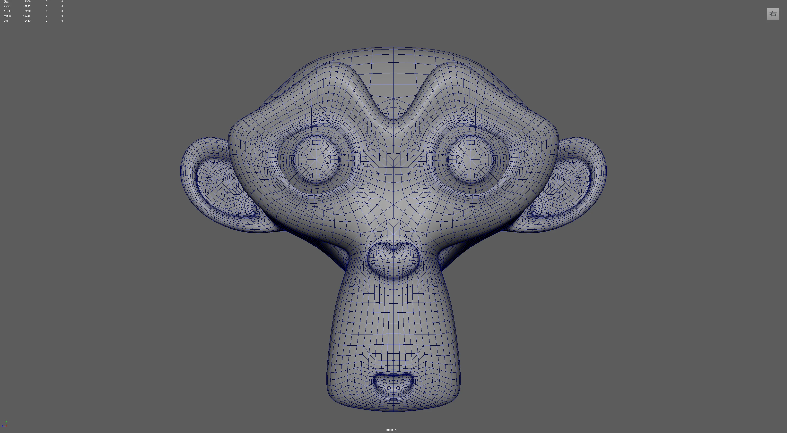
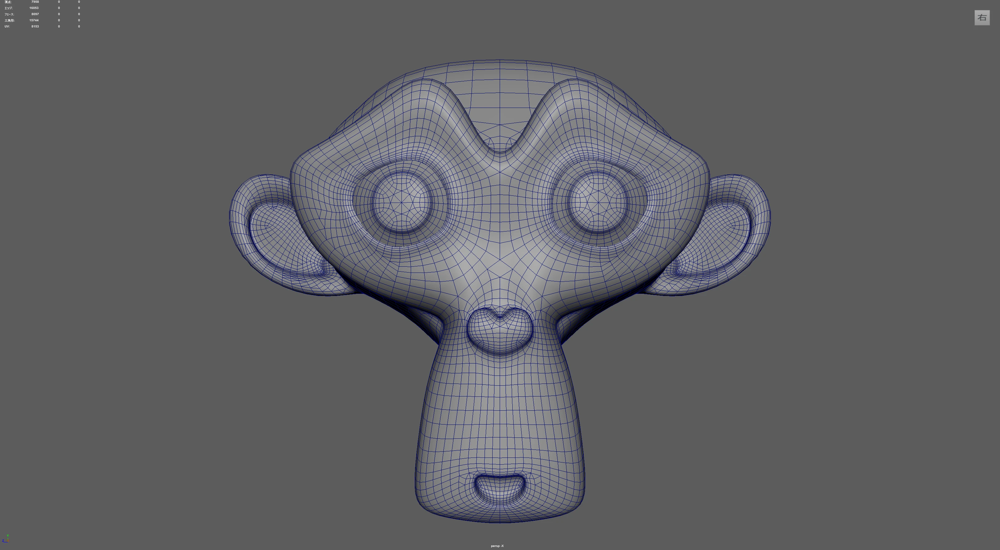
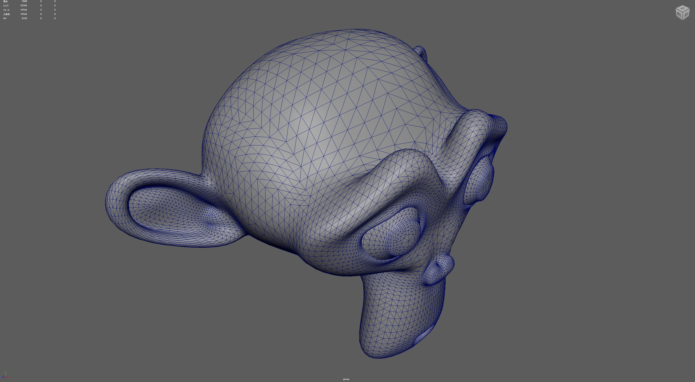
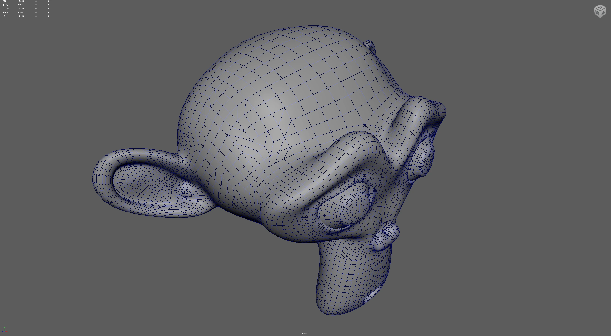
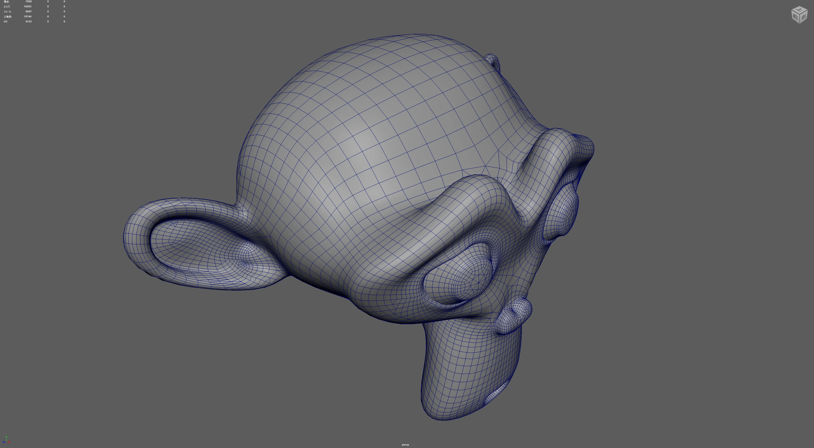
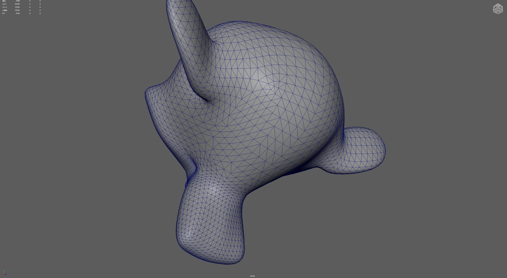
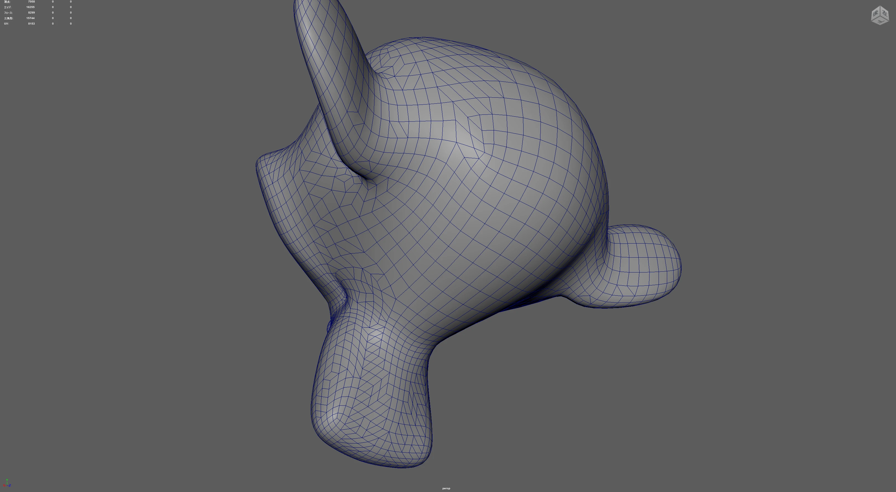
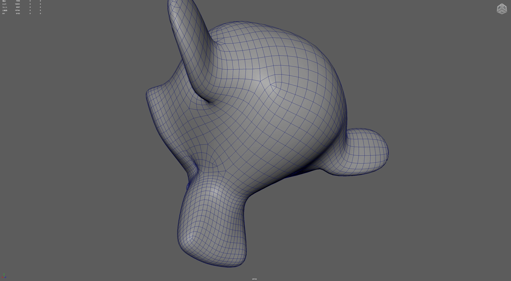

# Maya-SBTools

[English](README.md) | [日本語](README_JP.md)

**最新バージョン: v1.0.0**

Autodesk Maya 向けのユーティリティスクリプトおよびプラグインのコレクションです。

## インストール手順

1. Releases ページから `Maya-SBTools_v1.0.0.zip` をダウンロードします。
2. ダウンロードした ZIP ファイルを解凍します。
3. 解凍した `modules` フォルダを、Maya のユーザー設定ディレクトリ（例: `Documents\maya\`）にコピーします。
4. Maya を起動（または再起動）します。
5. メインメニューバーに **[SBTools]** というメニューが追加されていれば完了です。

## Triangles to Quads（三角面を四角化するツール）

Triangles to Quads は、Maya上の三角ポリゴンメッシュを、構造を維持したまま綺麗な四角ポリゴン（クアッド）に変換するツールです。Maya標準の「四角化（Quadrangulate）」と比較して、曲面の流れ（トポロジー）をより正確に汲み取るアルゴリズムを採用しているのが特徴です。

### 主な機能・メリット

- **高品質なグリッドフロー:** 隣接するポリゴンの流れを考慮するため、歪みが少ない自然なトポロジーを生成します。
- **高速処理:** 数万ポリゴンのメッシュでも数秒で処理が完了するように最適化されています。
- **境界の保護:** UV のシーム、マテリアルの境界、ハードエッジを跨いだ意図しないマージを防止できます。
- **Maya ネイティブ統合:** プログレスバーのサポートや、1回の操作としての Undo（元に戻す）に対応しています。

### Maya標準機能との比較

本ツールは、Blenderで定評のある四角化アルゴリズムをベースにしており、特に曲面における「四角形の整列」に強みがあります。

|                         アングル                         |         元の三角モデル         |           Maya標準の四角化           |            本ツールの四角化             |
| :------------------------------------------------------: | :----------------------------: | :----------------------------------: | :-------------------------------------: |
| **アングル 1** |  |  |  |
| **アングル 2** |  |  |  |
| **アングル 3** |  |  |  |

### 基本的な使い方

1. 四角化したいポリゴンメッシュを **オブジェクトモード** で選択します（複数選択可）。
2. メニューの `[SBTools] > [Triangles to Quads]` を実行します。

設定を変更したい場合は、メニュー横の **オプションボックス（□）** をクリックして設定画面を開きます。

### オプション設定の詳細

オプションウィンドウでは、以下のパラメーターを調整して変換結果をコントロールできます。

#### 角度しきい値

- **Face Normal Angle** (デフォルト: 40.0): 隣接する面同士の法線角度の差がこの値を超える場合、エッジはマージされません。
- **Shape Angle** (デフォルト: 40.0): 生成される四角形の角の角度が90度からどれくらいズレて良いかを指定します。

#### 境界の保持 (Keep Boundary)

- **Keep UV Boundary**: ONの場合、UVのシーム（継ぎ目）を跨いで四角化しません。
- **Keep Material Boundary**: ONの場合、異なるマテリアルが割り当てられた面同士をマージしません。
- **Keep Sharp Edge**: ONの場合、ハードエッジ（Sharp Edge）を維持します。

#### 拡張機能

- **Topology Influence** (0.0 ～ 2.0): 本ツールの核心的な設定です。
  - `0.0`: 形状の平坦さのみで評価します。
  - `1.0`: 標準設定。周囲の流れに合わせます。
  - `2.0`: 周囲のグリッドフローへの整列をより強力に優先します。

### 技術的なアプローチ

本ツールの背後では、高度な計算ジオメトリの最適化が行われています。

- **Blender アルゴリズムの移植:** 評価の高い Blender の `bmo_join_triangles` アルゴリズムを Maya Python API (OpenMaya) 向けに最適化して実装しています。
- **遅延評価付き優先度キュー:** すべてのエッジの「マージした際の品質（エラー値）」を計算し、品質が良い順に処理します。1つのエッジをマージすると、その周囲のエッジのスコアがリアルタイムに更新（連鎖）される仕組みになっています。
- **O(1) ルックアップ:** トポロジー走査を事前計算することで、大規模メッシュでも計算量が指数関数的に増えないよう工夫されています。
- **バッチ処理:** エッジの削除を Maya のコマンドに 1 回で渡す（`polyDelEdge`）ことで、API 呼び出しのオーバーヘッドを最小限に抑えています。

## ライセンス

This project is licensed under the **GNU General Public License v3.0**. See [LICENSE](LICENSE) for details.

## Changelog (Brief)

- **v1.0.0 (2026-05-13)**
  - Initial release.
  - Added Triangles to Quads plugin with Blender-style Topology Influence optimization.

For a full history of changes, see the [CHANGELOG](CHANGELOG.md).
